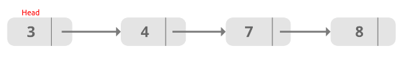

# Some types of data structure

## These are some types data structure. Below is presented each one

### Circular Queue

A circular queue is the extended version of a regular queue where the last element is connected to the list first element. In image below we can see a representation it.


#### How to work ?

Circular Queue works by the process of circular increment i.e. when we try to increment the pointer and we reach the end of the queue, we start from the beginning of the queue.

Here is code line that verify if current position is end them pointer go to first position of queue. The code line is in <i>imprimir function</i>.


```c
do{
        printf("%d  ",Aux->info);
        Aux=Aux->prox;
}while(Aux!=f->prox);
```

##### Operations

* cria_fila: This function create a pointer to structure queue.
* fila_vazia: This function verify if queue is empty.
* insere_fim: This function create a node where will be stored new element e after node will be linked in the last postion of queue.
* remove_ini: This function remove first element of queue. To do this is need manager pointer.
* imprimir: This function show all elements of queue.
* menu: This function was create to keep a interactive with user.


### Dynamic Queue

A dynamic queue is a data structure that consists of a set of elements that are placed sequentially one after another. In this case, the addition of elements is carried out on the one hand, and the removal (stretching) on the other hand. In image below we can see a representation it.


#### How to work ?

The queue works according to the FIFO principle – First In – First Out i.e. the first element is processed first and the newest element is processed last.
The manager of delete and insertion is did by two function called <i>insere_fim</i> and <i>remove_ini</i>.


##### Operations

* cria_fila: Create a pointer to the queue structure.
* fila_vazia: This function verify if  queue is empty.
* insere_fila: This function allocate a node and stores the element inside that node. Done that is  made the manipulation of pointers and insertion of node in the last position of queue.
* remove_ini: This function remove first element of queue. This is done by means of manipulation of pointers and through deallocation of removed node.
* imprimir: This function show all elements of the queue.
* menu: This function was create to keep a interactive with user.


### Sorted Dynamic List

 It's an variation of linked list, because the element is inserted in an orderly manner, then the use of sorting algorithms after insetion it's not necessary. 

 


#### How to work ?

It's work by means nodes. Every that an element is inserted is created a node that store the element and after the node will be linked in list according to sort criterion. To remove a node is necessary manipulation of pointers and deallocation of removed node. This code implements some functions of manipulation of list. I will talk about it in operations topic.

##### Operations

* cria_lista: This function create a pointer to list structure.
* lista_vazia: This function verify if the list is empty.
* insere_ord: This function insert element in position following the sort crterion.
* remove_ord: This function receive a element that will be search in list. If there is this element in list then it removed and done the manipulation of pointers. If there isn't this element in list then is return 0.
* imprimir: This function show all elements of list.
* removerImpares: This function removed all odd elements of list.
* menor: This function return less element of list.
* tamanho: This function return length of list.
* Iguais: This function compare if two lists are equals. if they are the same then return 1 else return 0.
* Intercala: This function receive two lists and does merge between two lists keeping the ordination.


### Sorted Dynamic List with head

It's an variation of sorted dynamic list, because the first node will be a head. This node will store amount elements of list.



#### How to work ?

It's work like as Sorted Dynamic List, but the first node wil be used to store amount elements of list. This is done in function insere_ord. Some functions are the same as in the other structure sorted dynamic list already explained. Bellow will explain only functions that are different.

##### Operations

* insere_ord: This function does allocation of node and find your the positon correct to put it on of list, <i>but the search begin of second element</i>, because the first element is amount of elements. And after is through pointers manipulation.
* remove: In this function is search the node of the element that will be removed and for this, the search start in second node. When the node is found then it's removed and done pointers manipulation. 
* imprimir: This function show all elements of the list, but to this it is necessary start in second node. Bellow is show the code line that do it.

```c
    Lista Aux=lst->prox;

```

* tamanho: This function return first node, because on them is the amount elements.


### Sorted Static List 

It's variation of static list. Here the elements are sorted during the insertion process.


#### How to work ?


### Static List


In Static data structure the size of the structure is fixed. The content of the data structure can be modified but without changing the memory space allocated to it.

#### How to work ?

First is defined a size to list. Then is inserted a element in position corresponding by index variable. This structure is used when we know amount of the element that be inserted in list.

##### Operations

* cria_lista: Create a structure that will allow store all elements of list and a index that will point to the last element if list.
* lista_vazia: Verify if list is empty.
* list_cheia: Verify if list is full.
* insere_elem: The element is inserted in the last position of list. It's possible because we know last position that is in index variable called of <i>Fim</i>.
* remove_elem: 